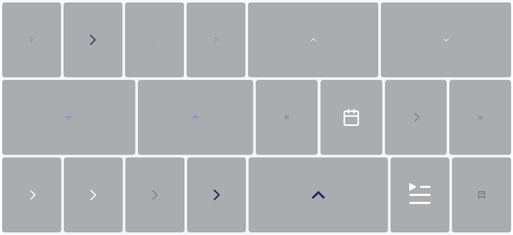

### what does this package do?
> list all your images in given directory and open a browser with them
> this is a cli tool not a web app


### example usage
```
npx preview-image-gallery src
 
```


### thanks
- [photo-grid-box-vanilla](https://www.cssscript.com/flickr-like-photo-grid/)


### images



### that's all
